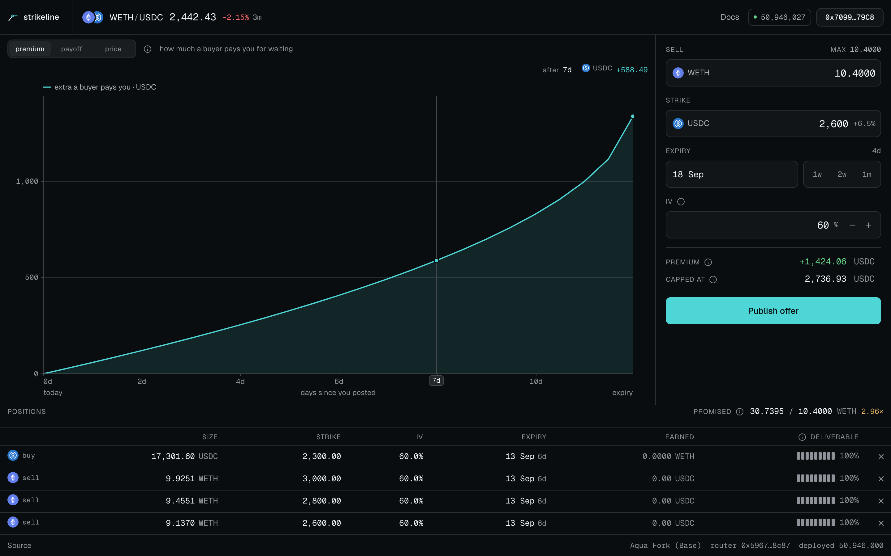

<p align="center"></p>

# Strikeline

**Name a price you'd be happy to sell your ETH at. Whoever takes it pays you for the wait. The ETH
never leaves your wallet.**

Built for ETHGlobal ETHOnline 2026 on **1inch Aqua**.

**Live demo: [strikeline-mu.vercel.app/app](https://strikeline-mu.vercel.app/app)** · click **Connect wallet → Demo wallet**.
The demo runs on a hosted fork of Base mainnet (an anvil node on a cloud VM) against the official
Aqua registry and real WETH/USDC balances, so anyone can publish and withdraw offers without funds.



## The idea

You hold ETH and you'd be happy to sell it at, say, $2,600. Strikeline lets you post that as an offer
with an expiry date. Until then the ETH stays in your wallet, and you get paid for the wait.

## Who pays you, and why

- **Who:** traders and arbitrage bots. Your offer is a quote on 1inch Aqua, so anyone swapping through
  Aqua can buy WETH from it.
- **Why they pay more over time:** the quote gets a little more expensive for a buyer every day nobody
  takes it. That growing gap is your **premium**.
- **When they trade:** when ETH moves enough that crossing the gap is still worth it, for example ETH
  rises and a bot buys your WETH to resell it elsewhere.
- **The catch:** you are paid only when someone trades. If nobody does, you keep your ETH and earn
  nothing.

**At expiry:** if ETH is below your price, you keep your ETH plus whatever trades paid you. If ETH is
above it, your ETH is sold at your price and you miss the upside beyond it.

*For options traders:* each offer is a covered call written as a pricing curve. The premium arrives as
a spread that widens with theta, not as an up-front credit. No vault, no option token, no oracle, no
keeper.

## How it works

Two custom SwapVM instructions on a redeployed router, settling against the **official Aqua registry**
`0x1111113CCf1426A8E30e2bfF5E005d929bF6a90a`.

**`RmmSwap`** (opcode `0x55`, [source](contracts/src/instructions/RmmSwap.sol)) is the option. It
implements RMM-01, the covered-call curve from Angeris, Evans & Chitra,
[*Replicating Market Makers*](https://arxiv.org/abs/2103.14769) and
[*Replicating Monotonic Payoffs Without Oracles*](https://arxiv.org/abs/2111.13740):

```
Y = L·K·Φ( Φ⁻¹(1 − X/L) − σ√τ )        τ = max(maturity − block.timestamp, 1h) / 365d
```

Holding reserves on this curve is exactly long spot and short a call at strike `K` and volatility `σ`.
Because `τ` is read from the block clock, the curve ages with no transaction: a spread opens that the
next taker has to pay. At expiry `τ = 0` and the curve becomes `Y = K·(L − X)`, a plain limit order
at the strike, so assignment is an ordinary swap.

**`Coverage`** (opcode `0x93`, [source](contracts/src/instructions/Coverage.sol)) is the margin. Aqua
lets a maker advertise more than their wallet holds. `Coverage` runs the curve, then refuses any quote
the maker's real balance and allowance cannot deliver. Every offer reads the same wallet, so one
wallet can back many offers, and **a fill on one offer shrinks what the others can deliver, in the
same block**.

## Built with

**1inch Aqua + SwapVM.** Offers are SwapVM programs on the official Aqua registry, priced by the two
instructions above ([`contracts/`](contracts/)).

**Protocol fee.** Every fill pays 0.10% of the taker's input to the protocol treasury, using 1inch
SwapVM's own `FeeProtocol` instruction. The maker's premium is untouched: only the net input reaches
their reserves. See [`docs/PROTOCOL-FEE.md`](docs/PROTOCOL-FEE.md).

## Evidence

| Claim | Proof |
|---|---|
| Decay opens a spread with no transaction | `test_Theta_DecayOpensASpread` |
| A fill on one offer shrinks its siblings' depth | `test_Book_FillOnOneLegShrinksSiblingDepth` |
| Without `Coverage` the depth is phantom | `test_Book_WithoutCoverageTheDepthIsPhantom` |
| Expiry settles at the strike | `test_Expiry_SettlesAtStrikeOneWay` |
| Rolling an offer moves zero tokens | `test_Roll_MovesNoTokensAndCanRepeatParameters` |
| Quotes match swaps | `testFuzz_QuoteEqualsSwap`, 256 runs |
| Works with real liquidity | Fork tests fill real WETH/USDC through the official contracts and the unmodified official router |

**147 offline tests pass** (`make test`), plus 11 fork tests. The router is 23,851 bytes, under the
EIP-170 limit, and a fill costs 211k gas (about a cent on Base).

**Does it pay?** In a replay of a week of real Chainlink ETH/USD prices on Base, a four-offer book beat
holding by **+201 USD** on about 50k of capital. It collected only 31% of its time value, because the
arbitrageur declined 4,409 of 4,740 chances to trade. Written *below* realised volatility, a plain
pool beats it, and the price never reached the strike, so assignment is untested in the replay.

## Honest limits

- **You are not paid up front.** The premium is only realised when someone crosses the spread.
- **It is short volatility.** It loses when the market moves more than the vol you chose.
- **Offers can be withdrawn at any moment**, so a buyer cannot rely on one like an exchange-listed option.
- **The app writes covered calls on WETH/USDC.** The instruction is pair-agnostic and becomes a
  cash-secured put when the reserves start in USDC; the ticket does not offer that side yet.

## Running it

```bash
make install       # once
make fork          # terminal 1: anvil fork of Base at block 50,946,000, using the real Aqua registry
make story-setup   # terminal 2: deploy the router, fund the demo wallets, freeze the state
make story-load    # rewind to the frozen state (about a second)
make story-1       # four live offers from one wallet
make web           # http://localhost:3000 (the app is at /app)
```

In the app, **Connect wallet → Demo wallet** signs with the same local test account the scenes use. The ✕ on
a position arms on the first click and withdraws on the second.

`make story-0` to `make story-6` are the scripted demo. Each scene makes a real transaction on the fork
and checks its own claim; the [runbook](scripts/story/README.md) lists them.

## Further reading

- [`docs/IN-DEPTH.md`](docs/IN-DEPTH.md): the instructions in detail, the full replay study
  and prior art
- [`docs/ARCHITECTURE.md`](docs/ARCHITECTURE.md): which contract holds the tokens and which holds the price
- [`docs/OPCODES.md`](docs/OPCODES.md): byte layouts and gas
- [`contracts/`](contracts/README.md), [`web/`](web/README.md), [`scripts/`](scripts/README.md):
  per-package READMEs
- [`subgraph/`](subgraph/README.md): a read layer that decodes every offer from Aqua's `Shipped` log.
  Included and tested, but not deployed, and the app does not read from it

## License and AI usage

Contracts under MIT. Consumes `@1inch/aqua` and `@1inch/swap-vm` under their Degensoft source
licenses. AI tooling usage is disclosed in [`docs/AI-USAGE.md`](docs/AI-USAGE.md).
