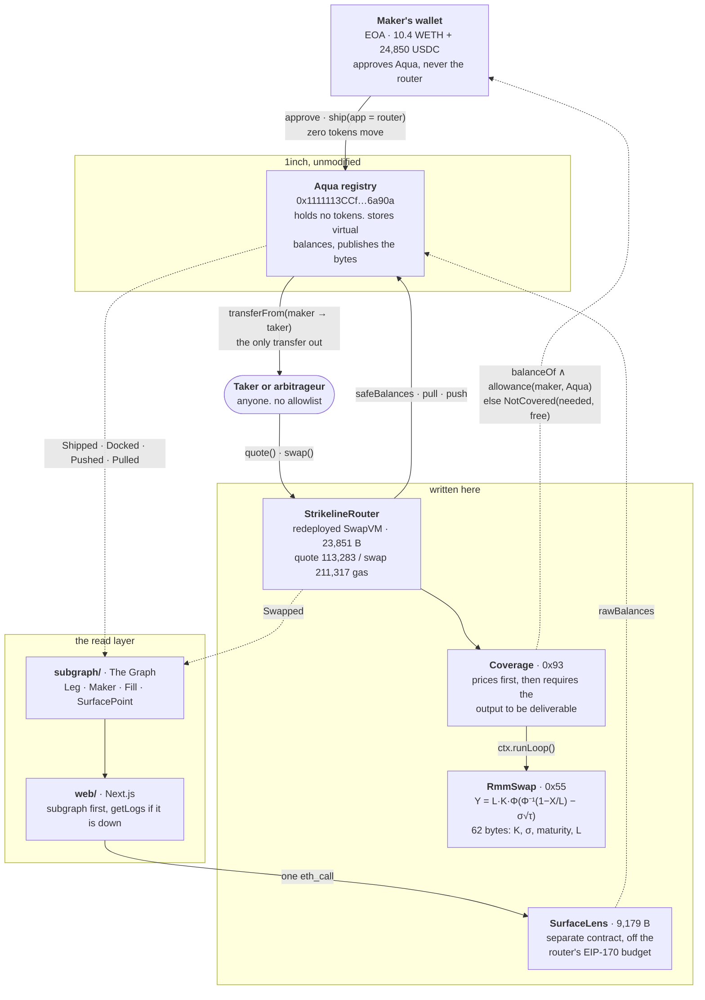

# Architecture

A maker names a price they would be happy to sell their ETH at. Whoever takes it pays them for the
wait. The ETH never leaves the maker's wallet, and the offer can be withdrawn at any moment, so
nothing here is a promise the maker cannot take back.

This document is the map of how that works in the code: which box holds the tokens, which box holds
the price, which box is 1inch's and which box is ours.

*If you already trade options:* the maker is short a covered call, the strike and the vol are theirs
to pick, and the premium arrives as a two-sided spread that widens with theta rather than as an
up-front credit. Nothing below assumes you read that sentence.



## The one fact the diagram exists to show

**No box in the picture holds the maker's tokens.** Aqua's `_balances` mapping is commented, in
1inch's own source, as *"aka makers' allowances"* (`Aqua.sol:24`, in `@1inch/aqua`).
`ship` writes numbers; `pull` is `safeTransferFrom(maker, to, amount)` and `push` is
`safeTransferFrom(msg.sender, maker, amount)`. So the WETH sits in the EOA the whole time, and the
one transfer that ever moves it goes straight from the maker's wallet to the taker.

That single fact is what the rest of the design is built out of. It is why a wallet holding 10.4 WETH
can advertise a 27.51 WETH ladder, why rolling to the next expiry moves zero tokens, and why
`Coverage` has to exist.

## Writing a leg

One leg is four SwapVM instructions, assembled by
[`buildLegProgram`](../web/src/components/curve/rmm.ts) and mirrored byte for byte in Solidity:

```
Deadline(maturity + 30m) · Coverage(flags, haircutBps) · RmmSwap(σ, maturity, K, L, rates) · Salt(n)
```

1. The maker approves **Aqua** for WETH and USDC. The router is never approved and never holds a
   balance.
2. `Aqua.ship(app = StrikelineRouter, strategy, tokens, amounts)` records the virtual reserves and
   emits `Shipped(maker, app, strategyHash, strategy)` — carrying the program bytes verbatim,
   because Aqua takes the strategy *"fully instead of being pre-hashed, for data availability"*.
   No token moves.
3. Reserves must sit **exactly** on the curve as the router computes it, so the maker asks the chain
   where the curve is rather than computing it off-chain: `StrikelineViews.stableFor(...)`. One wei
   low bricks the leg permanently; one wei high is a gift to the first taker.

`Salt` is a maker-owned monotonic nonce. `dock` marks a strategy hash dead forever, so a roll to the
same strike and expiry would otherwise collide with the leg it replaces.

## Filling a leg

`quote()` and `swap()` take the same path and run the whole program before any token moves, which is
why `quote() == swap()` holds by construction and is fuzzed for 256 runs
(`testFuzz_QuoteEqualsSwap`).

1. `AQUA.safeBalances(maker, router, hash, tokenIn, tokenOut)` loads the virtual reserves the curve
   will price against.
2. The VM dispatches `Coverage` (`0x93`) first. It calls `ctx.runLoop()` to execute the *rest* of the
   program, so pricing happens on the true shipped reserves.
3. `RmmSwap` (`0x55`) prices the trade. Pure leaf instruction: reads `block.timestamp`, touches no
   storage, runs under `STATICCALL`.
4. `Coverage` then reads the maker's real `balanceOf` and their remaining `allowance(maker, AQUA)`,
   takes the smaller, applies `haircutBps`, and requires the priced output to fit. It reverts
   `NotCovered(needed, free)` rather than clamping, so the error carries the number to retry with.
5. Settlement, in whichever order the taker's traits asked for: `AQUA.pull(maker, hash, tokenOut,
   amountOut, taker)` moves the output straight from the wallet to the taker, and the input arrives
   as `transferFrom(taker → router)` then `AQUA.push(...)` into the maker's wallet.
6. The router emits `Swapped`; Aqua emits `Pulled` and `Pushed`.

**`Coverage` runs after the curve on purpose.** Clamping `balanceOut` before the curve ran would move
the reserve point, and therefore change the *price* rather than just the size — quoting a different
option than the maker wrote.

The consequence is the interesting part: every leg reads the same wallet, so a fill on one leg
shrinks its siblings' deliverable depth in the same block, with no keeper, no shared storage and no
message passing. Measured: a 5 WETH fill takes the shared wallet 10.4 → 5.4 WETH, after which the
siblings refuse 6 WETH and still fill 2.7.

## The read layer

Because the strategy bytes are public, every option any maker has ever written on this router is
decodable by anyone holding the log, with no cooperation from the maker. Three implementations
decode the same 62 argument bytes at the same offsets, and each degrades to the next:

| | What it is | Fails to |
|---|---|---|
| [`SurfaceLens.sol`](../contracts/src/SurfaceLens.sol) | Prices a whole book in one `eth_call`: terms, live reserves, mark, delta, premium, theta band. A separate contract, so it spends none of the router's 725 B of EIP-170 headroom. Every batch entry is `try/catch`-isolated. | its own init code, run inline inside one `eth_call`, when nothing is deployed |
| [`subgraph/`](../subgraph/README.md) | Indexes Aqua's `Shipped`/`Docked`/`Pushed`/`Pulled` and the router's `Swapped`, decoding the bytes in the AssemblyScript mapping into `Leg`, `Maker`, `Fill`, `SurfacePoint`. | a direct `getLogs` on the same `Shipped` events through viem |
| [`web/src/components/surface`](../web/src/components/surface/useSurface.ts) | Strike on x, expiry on y, implied vol as the surface. Needs no wallet: it reads a public log. | — |

Aqua's events carry **no indexed parameters**, so the app filter lives in the mapping rather than in
a topic. And Aqua has no order book: a strategy is opaque bytes keyed by its own hash, and nothing in
the registry relates two makers who wrote the same option. `SurfacePoint` is that missing relation.

## Ours and 1inch's

| | Where | Modified? |
|---|---|---|
| Aqua registry `0x1111113CCf1426A8E30e2bfF5E005d929bF6a90a` | `@1inch/aqua` | **Never redeployed, never modified.** Every leg settles through it |
| SwapVM instruction set | `@1inch/swap-vm` | Unmodified, and kept whole apart from `PeggedSwap`, dropped for −1,394 B of EIP-170 room. `FeeProtocol` included, so programs written for the official router still run here |
| `StrikelineRouter` | [`contracts/src/StrikelineRouter.sol`](../contracts/src/StrikelineRouter.sol) | A redeployed SwapVM, which the track permits. 61 lines, most of them the comment: it adds two opcodes to `_runOpcode` and nothing else |
| `RmmSwap` `0x55`, `Coverage` `0x93` | [`contracts/src/instructions/`](../contracts/src/instructions/) | Ours. The contribution |
| `Gaussian.sol`, `WadMath.sol` | [`contracts/src/math/`](../contracts/src/math/) | Ours (A&S 7.1.26 erfc + bisection over solady) |
| `SurfaceLens`, `subgraph/`, `web/` | see the table above | Ours |

## Where the boxes live

```
contracts/src/StrikelineRouter.sol      the router in the diagram
contracts/src/instructions/             the two boxes inside it
contracts/src/SurfaceLens.sol           the lens, deliberately outside it
contracts/src/hooks/                    the same curve as a Uniswap v4 hook, for the venue comparison
subgraph/src/                           the mapping that decodes Shipped
web/src/lib/swapvm/                     the TypeScript encoder, verified against Solidity golden vectors
web/src/components/surface/             the three-source read path
scripts/fork/                           anvil Base fork, bootstrap, oracle mock, time warp
scripts/story/                          the seven demo scenes
```

## Regenerating the diagram

The fenced block above is the source. The `.mmd` and the `.svg` in `docs/diagrams/` are derived from
it, so extract and render rather than editing them by hand:

```bash
sed -n '/^```mermaid$/,/^```$/p' docs/ARCHITECTURE.md | sed '1d;$d' > docs/diagrams/architecture.mmd
npx -y @mermaid-js/mermaid-cli@11 -i docs/diagrams/architecture.mmd \
  -o docs/diagrams/architecture.svg -t dark -b '#0c1013' -w 1300
```

`#0c1013` is `--bg` from [`web/src/app/globals.css`](../web/src/app/globals.css), so the diagram sits
on the same ground as the app.
